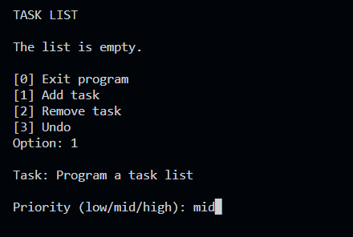
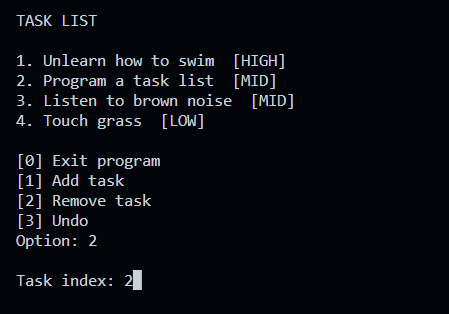
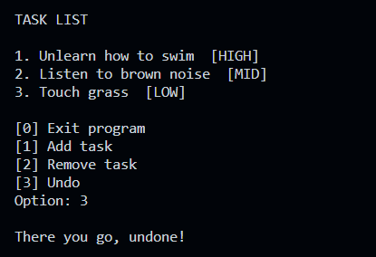

# Task List

Implementation of a task list using an ordered list and a stack, based on a Data Structures project. It's possible to add and remove tasks, choose a priority level for each task and undo your actions.

## Images

---

---

## Authors
- [Guilherme Bortoletto](https://github.com/guilherme-bortoletto)
- [Ryan Sakurai](https://github.com/ryansakurai)
- [Vinicius Castro](https://github.com/vinciuscastro)

*(Computer Science students at UFSCar - Federal University of São Carlos)*
